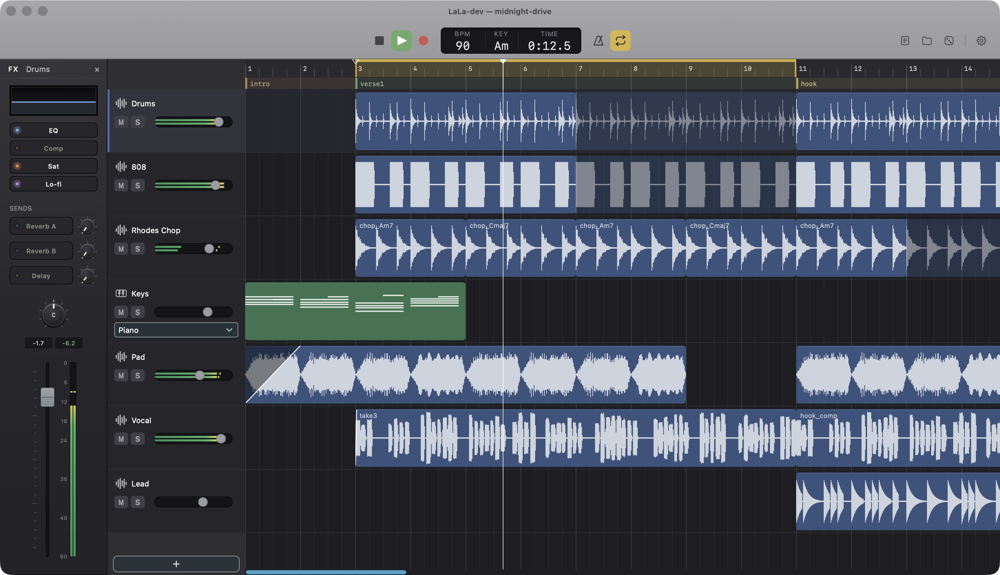

# LaLa

Logic Pro の代替として自分用に作った DAW。JUCE + 自作 DSP、macOS 専用。



マルチトラック録音（カウントイン・パンチイン）・ピアノロール・ミキサーとセンドバス・非破壊の移調/タイムストレッチ・ボーカルのピッチ補正・セクションマーカー・サンプラー・バウンス・アプリ内自動アップデートまで、ビートメイク〜録音〜ミックスを一通り通せる。

## Highlights

- **ボーカルのピッチ補正を自作。** YIN でピッチ検出し WORLD で再合成する非破壊エディタ（自動スナップ＋ノート手直し・解析結果はサイドカーに世代保存）。合成方式は候補をラベルで伏せたブラインド試聴（正解表つき）で選定した
- **FX は全部自作 DSP**（EQ・Comp・Saturation・Lo-fi・Reverb・Delay・Limiter）。汎用プラグインホスティングは「作れないから無い」のではなく、検討した上で削った（[docs/design/fx-roadmap.md](docs/design/fx-roadmap.md) に経緯）
- **出音の回帰はビット一致で固定。** エンジン/バウンスの6経路を決定的レンダリングして FNV-1a ハッシュで比較し、DSP を触った変更が既存プロジェクトの出音を変えていないことを機械判定する（`scripts/check-render-hashes.sh`）
- **スレッド境界 = ディレクトリ境界。** `Source/audio/` はリアルタイムスレッド専用で、ロック・メモリ確保・`ui/` への参照を持たない。スレッド間の受け渡しは `shared/` の lock-free 構造だけ。踏んだ罠は [GOTCHAS.md](GOTCHAS.md) に蓄積している
- **リファレンス曲の分析パイプライン**（Python・`tools/`）。参照曲を onset / BPM / スペクトルで分解してアプリ内レポートとドラム/ベースのガチャ生成に接続する。コーパス比較の統計の作法（halo 効果対策・相関した軸への omnibus 検定）も [docs/design/](docs/design/) に文書化してある

## スタンス

- **個人用**。販売・配布・サポートの予定はない
- **Issue / Pull Request は受け付けない**。自分の好みで好き勝手に変えていく
- **フォークして自分用に改造するのは自由**。ライセンスは AGPL-3.0（JUCE の無償利用条件に合わせた）
- リポジトリ名と内部識別子は旧名 `daw` のまま（意図的。経緯は [docs/operations.md](docs/operations.md)）

> **Note (English):** Personal project. No support, no issues, no pull requests. Fork it and make it yours — it's AGPL-3.0.

## ビルド

```sh
cmake -B build -DCMAKE_BUILD_TYPE=Debug   # 初回はJUCE 8.0.9の取得で数分かかる
cmake --build build
open build/daw_artefacts/Debug/LaLa-dev.app
```

依存ソフト・テスト・リリース手順は [docs/operations.md](docs/operations.md)、設計判断は [docs/design/](docs/design/)、動作確認手順は [VERIFY.md](VERIFY.md) を参照。
